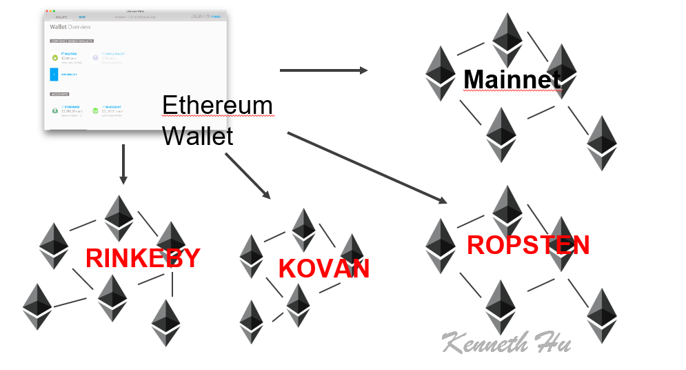

# Project 3 - Union Square Testnet

## For our final project for the Columbia FinTech Program, we decided to build a fully functioning testnet on Ethereum. Below is a quick summary of our project:

#### 1. We decided to name our Testnet after Union Square in New York City, paying homage to the Ethereum developers who have always named their own testnets after subway stations across the world.

    

#### 2. After trying out a few different guides, we settled on the ULAM labs guide and were able to get the newtwork fully functional on our local desktops

