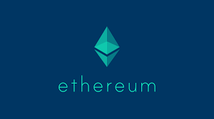
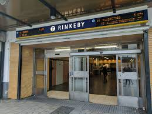
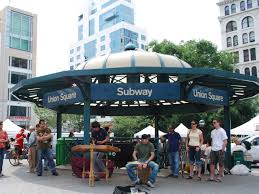

# Project 3 - Union Square Testnet

For our final project for the Columbia FinTech Program, we decided to build a fully functioning testnet on Ethereum. Below is a quick summary of our project:

1. We decided to name our Testnet after Union Square in New York City, paying homage to the Ethereum developers who have always named the cryptocurrencies own testnets after subway stations across the world.

2.
